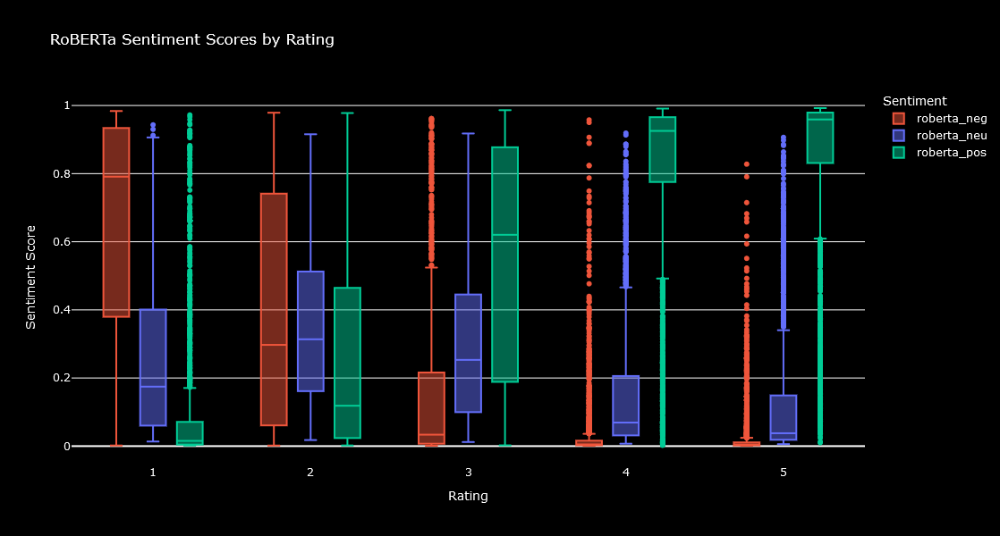

# Restaurant Sentiment Analysis

- **Objective**: Analyze 10,000 customer reviews from 100 different restaurants to classify sentiment and understand customer satisfaction.

- **Model**: Three models were conducted: VADER (Valence Aware Dictionary and sEntiment Reasoner), RoBERTa (Robustly optimized BERT approach) and BERT (Bidirectional Encoder Representations from Transformers)

- **Impact**: Provide valuable insights into customer satisfaction trends across restaurants, helping to identify strengths and areas for improvement in customer service.

## Resources Used

**Python Version**: 3.12.1

**Packages**: pandas,numpy, seaborn, matplotlib, plotly, spacy, transformers, scipy, torch, nltk, string, IPython, tqdm

**Pre-trained Models**: 

- VADER ( https://arturosbn.medium.com/pre-trained-python-model-for-sentiment-analysis-c32dea62e201)
- BERT (https://huggingface.co/docs/transformers/model_doc/bert)
- RoBERTa (https://huggingface.co/docs/transformers/model_doc/roberta)

**Dataset**: https://www.kaggle.com/datasets/joebeachcapital/restaurant-reviews

## Data Cleaning

- Null values were dropped
- Punctuation, URLS, Hashtahs, stopwords were removed, contractions were converted to their expanded form and all the reviews were converted to lowercase
- The reviews were tokenized

## Exploratory Data Analysis

Graph to understand the distribution of the Ratings

## Model Building

## 1 Model : VADER (Valence Aware Dictionary and sEntiment Reasoner)

For this model is was neccesary to use the SentimentIntensityAnalyzer which gives back, after being applied to all the reviews, four scores. To represent the outcome, the Compound Score was used.

## 2 Model : RoBERTa (Robustly optimized BERT approach)

The steps for this model were, first to load the Model and Tokenizer, using the pre-trained model for sentiment analysis, then a function that tokenizes text, applies the model and returns sentiment scores was created, which was iterated over each row in the DataFrame to get the final results.

## 2 Model : BERT (Bidirectional Encoder Representations from Transformers)

The steps taken here are similar to the RoBERTa Model, nlptown/bert-base-multilingual-uncased-sentiment was used for sentiment analysis, a sentiment_score function that tokenizes test was created and applied the the DataFrame, giving back scores ranging from 1 to 5.

